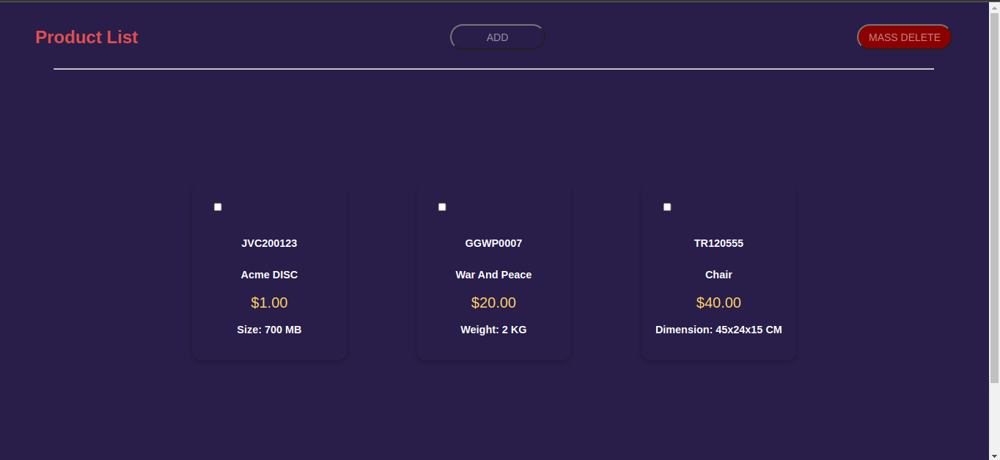
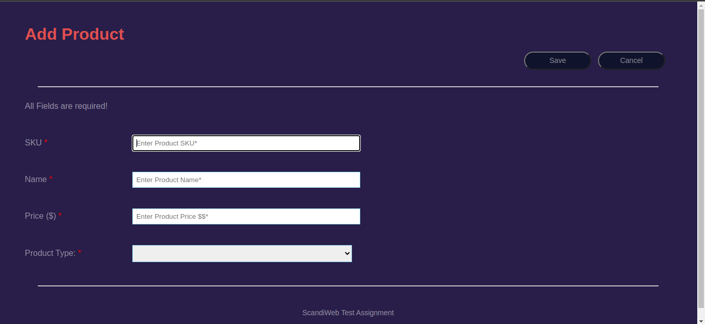
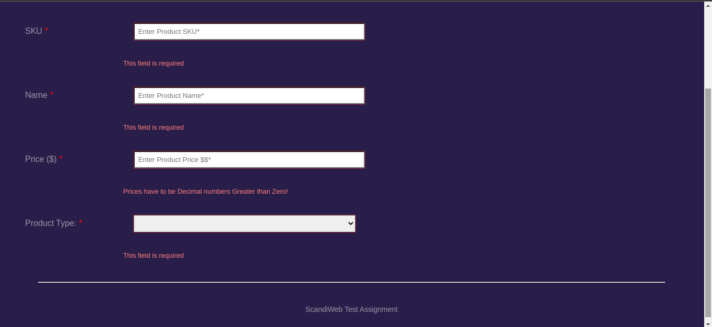
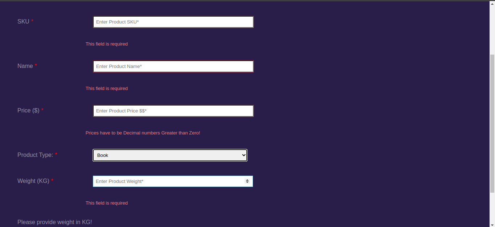
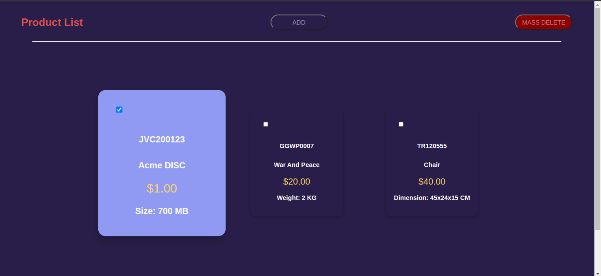

This project was bootstrapped with [Create React App](https://github.com/facebookincubator/create-react-app).

## Table of Contents
- [Current Scope](#current-scope)
- [Project Status](#project-status)
- [Project Screen Shots](#project-screen-shots)
- [Installation and Setup Instructions](#installation-and-setup-instructions)
  - [Getting The Codebase](#getting-the-codebase)
  - [Installation](#installation)
- [Available Scripts](#available-scripts)
  - [npm start](#npm-start)
  - [npm test](#npm-test)
  - [npm run build](#npm-run-build)
- [Supported Language Features and Polyfills](#supported-language-features-and-polyfills)
- [Syntax Highlighting in the Editor](#syntax-highlighting-in-the-editor)
- [Displaying Lint Output in the Editor](#displaying-lint-output-in-the-editor)
- [Debugging in the Editor](#debugging-in-the-editor)

## Current Scope

A web application used to manipulate products.

## Project Status

This project is currently in development. Users now can Add new product, List products, and Mass delete existing ones.

## Project Screen Shots








## Installation and Setup Instructions

You need `NodeJS ~16.x` and `npm ~8.x` installed globally on your machine. Or if you're using something like `nvm` consult accordingly.

### Getting The Codebase:

The simplest way to obtain the code is using the github .zip feature. Click [here](https://github.com/ahmadSaeedGoda/scandiweb-web-frontend/archive/refs/heads/develop.zip) to get the latest stable version as a .zip file.

The recommended way is using `git`. You'll need to make sure `git version ~2.34.1` is installed on your machine. Use a terminal or Power Shell to visit the directory where you'd like to have the source code, then type in:
```sh
$ git clone https://github.com/ahmadSaeedGoda/scandiweb-web-frontend.git
```

### Installation:
Run the following command to install required dependencies.
```sh
$ npm install
```
Then refer to the [Available Scripts](#Available-Scripts) section for more info.

## Available Scripts

In the project directory, you can run:

### `npm start`

Runs the app in the development mode.<br>
Open [http://localhost:3000](http://localhost:3000) to view it in the browser.

The page will reload if you make edits.<br>
You will also see any lint errors in the console.

### `npm test`

Launches the test runner in the interactive watch mode.

### `npm run build`

Builds the app for production to the `build` folder.<br>
It correctly bundles React in production mode and optimizes the build for the best performance.

The build is minified and the filenames include the hashes.<br>
Your app is ready to be deployed!

## Supported Language Features and Polyfills

This project supports a superset of the latest JavaScript standard.<br>
In addition to [ES6](https://github.com/lukehoban/es6features) syntax features, it also supports:

* [Exponentiation Operator](https://github.com/rwaldron/exponentiation-operator) (ES2016).
* [Async/await](https://github.com/tc39/ecmascript-asyncawait) (ES2017).
* [Object Rest/Spread Properties](https://github.com/sebmarkbage/ecmascript-rest-spread) (stage 3 proposal).
* [Class Fields and Static Properties](https://github.com/tc39/proposal-class-public-fields) (stage 2 proposal).
* [JSX](https://facebook.github.io/react/docs/introducing-jsx.html) and [Flow](https://flowtype.org/) syntax.

Learn more about [different proposal stages](https://babeljs.io/docs/plugins/#presets-stage-x-experimental-presets-).

Note that **the project only includes a few ES6 [polyfills](https://en.wikipedia.org/wiki/Polyfill)**:

* [`Object.assign()`](https://developer.mozilla.org/en/docs/Web/JavaScript/Reference/Global_Objects/Object/assign) via [`object-assign`](https://github.com/sindresorhus/object-assign).
* [`Promise`](https://developer.mozilla.org/en-US/docs/Web/JavaScript/Reference/Global_Objects/Promise) via [`promise`](https://github.com/then/promise).
* [`fetch()`](https://developer.mozilla.org/en/docs/Web/API/Fetch_API) via [`whatwg-fetch`](https://github.com/github/fetch).

If you use any other ES6+ features that need **runtime support** (such as `Array.from()` or `Symbol`), make sure you are including the appropriate polyfills manually, or that the browsers you are targeting already support them.

## Syntax Highlighting in the Editor

To configure the syntax highlighting in your favorite text editor, head to the [relevant Babel documentation page](https://babeljs.io/docs/editors) and follow the instructions. Some of the most popular editors are covered.

## Displaying Lint Output in the Editor

Some editors, including Sublime Text, Atom, and Visual Studio Code, provide plugins for ESLint.

They are not required for linting. You should see the linter output right in your terminal as well as the browser console. However, if you prefer the lint results to appear right in your editor, there are some extra steps you can do.

You would need to install an ESLint plugin for your editor first.

>**A note for Atom `linter-eslint` users**

>If you are using the Atom `linter-eslint` plugin, make sure that **Use global ESLint installation** option is checked:

>


>**For Visual Studio Code users**

>VS Code ESLint plugin automatically detects Create React App's configuration file. So you do not need to create `eslintrc.json` at the root directory, except when you want to add your own rules. In that case, you should include CRA's config by adding this line:

>```js
{
  // ...
  "extends": "react-app"
}
```

Then add this block to the `package.json` file of your project:

```js
{
  // ...
  "eslintConfig": {
    "extends": "react-app"
  }
}
```

Finally, you will need to install some packages *globally*:

```sh
npm install -g eslint-config-react-app@0.3.0 eslint@3.8.1 babel-eslint@7.0.0 eslint-plugin-react@6.4.1 eslint-plugin-import@2.0.1 eslint-plugin-jsx-a11y@4.0.0 eslint-plugin-flowtype@2.21.0
```

We recognize that this is suboptimal, but it is currently required due to the way we hide the ESLint dependency. The ESLint team is already [working on a solution to this](https://github.com/eslint/eslint/issues/3458) so this may become unnecessary in a couple of months.

## Debugging in the Editor

**This feature is currently only supported by [Visual Studio Code](https://code.visualstudio.com) editor.**

Visual Studio Code supports live-editing and debugging out of the box with Create React App. This enables you as a developer to write and debug your React code without leaving the editor, and most importantly it enables you to have a continuous development workflow, where context switching is minimal, as you don’t have to switch between tools.

You would need to have the latest version of [VS Code](https://code.visualstudio.com) and VS Code [Chrome Debugger Extension](https://marketplace.visualstudio.com/items?itemName=msjsdiag.debugger-for-chrome) installed.

Then add the block below to your `launch.json` file and put it inside the `.vscode` folder in your app’s root directory.

```json
{
  "version": "0.2.0",
  "configurations": [{
    "name": "Chrome",
    "type": "chrome",
    "request": "launch",
    "url": "http://localhost:3000",
    "webRoot": "${workspaceRoot}/src",
    "userDataDir": "${workspaceRoot}/.vscode/chrome",
    "sourceMapPathOverrides": {
      "webpack:///src/*": "${webRoot}/*"
    }
  }]
}
```

Start your app by running `npm start`, and start debugging in VS Code by pressing `F5` or by clicking the green debug icon. You can now write code, set breakpoints, make changes to the code, and debug your newly modified code—all from your editor.
